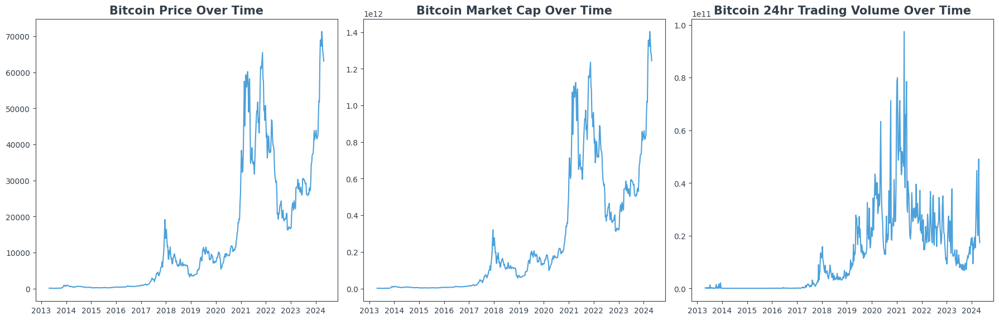
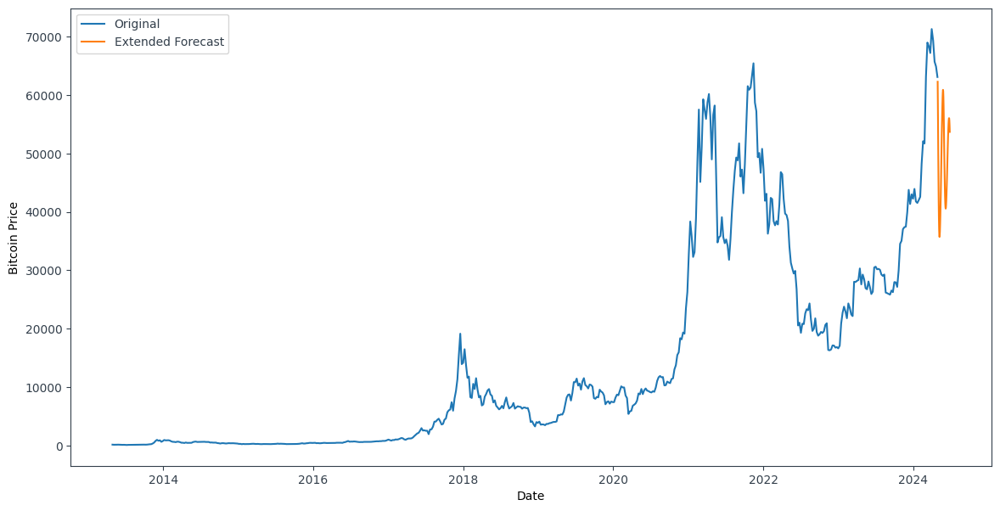

# Cryptocurrency Web Scraping and Data Analysis

This repository contains scripts for scraping, cleaning, and analyzing cryptocurrency data from CoinMarketCap. The project aims to provide insights into cryptocurrency trends, market dynamics, and predictions based on historical data. It covers a comprehensive approach from data extraction to predictive modeling.

## Features

### Data Extraction

The script initiates by scraping historical data links from CoinMarketCap and then proceeds to extract detailed cryptocurrency data including:
- Price
- Market Cap
- Trading Volume
- Circulating Supply
- Short-term and long-term percentage changes

### Data Transformation

Post-extraction, the data undergoes several transformation steps:
- Conversion of date strings to `datetime` format for better manipulation.
- Cleansing of numeric fields by removing non-numeric characters and converting strings to numeric types.
- Imputation of missing values using KNN to preserve underlying data patterns.

### Data Analysis

Several analytical techniques are applied to the processed data:
1. **Time Series Analysis**: Examines trends in Bitcoin’s price, market cap, and trading volumes over time.
2. **Correlation Analysis**: Identifies the strength and direction of relationships between different financial metrics.
3. **Trend Analysis**: Calculates and visualizes growth rates for cryptocurrencies to spot significant value changes.
4. **Volatility Analysis**: Assesses the stability and risk associated with cryptocurrencies by calculating the standard deviation of price changes.
5. **Predictive Analysis**: Employs an LSTM model to forecast future price movements of Bitcoin.

## Outputs and Visualizations

- **CSV File**: `output.csv` containing the cleaned and structured cryptocurrency data.
- **Graphs**:
  - **Bitcoin Analysis**: 

  - **Predictions**: 

## Contribution

Contributions to this project are welcome! You can contribute in several ways:
- Enhancing the data scraping capabilities to include more cryptocurrencies.
- Improving the predictive models by experimenting with different architectures or features.
- Adding more sophisticated data visualization techniques.

Please submit pull requests for any contributions you make.
